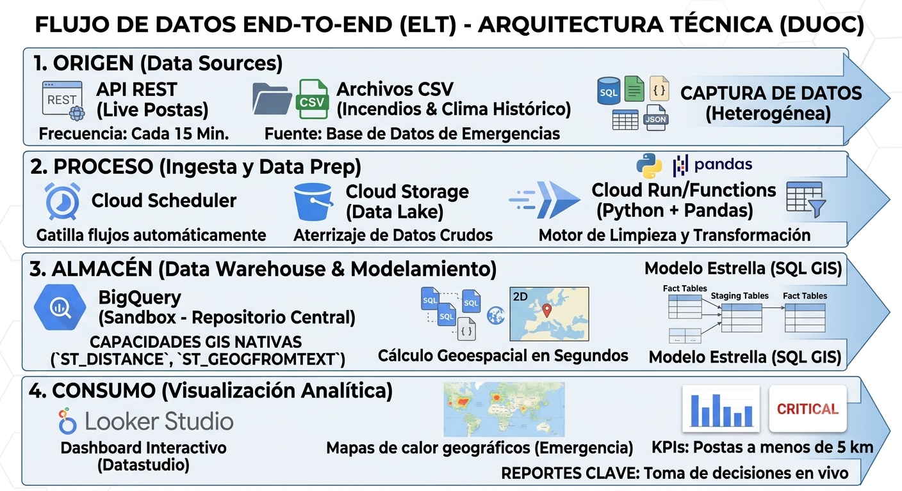

# 🔥 Big Data Wildfire Risk Analysis

Big Data solution for wildfire risk monitoring on critical healthcare infrastructure in Chile — GCP, BigQuery, Cloud Run, Looker Studio + RBAC.

## Descripción

Este proyecto desarrolla una solución Big Data para monitorear el impacto de incendios forestales sobre infraestructura crítica de salud en Chile, específicamente **postas rurales**.

La solución integra tres fuentes de datos, implementa procesos ELT automatizados, construye un modelo dimensional en BigQuery y genera alertas geoespaciales cruzando incendios activos con postas rurales cercanas, apoyadas por condiciones meteorológicas en tiempo real.

---

## Problema

Chile enfrenta cada año incendios forestales que pueden afectar la infraestructura crítica de salud rural. Sin embargo, la información está distribuida entre múltiples fuentes, dificultando el monitoreo oportuno del riesgo para el personal sanitario en zonas apartadas.

---

## Solución

Se diseñó una arquitectura Big Data basada en Google Cloud Platform que permite:

- Ingestar datos de 3 fuentes distintas (batch + streaming)
- Procesar y transformar datos mediante ELT en BigQuery
- Calcular distancias geoespaciales reales entre incendios y postas
- Generar alertas por nivel de proximidad y riesgo climático
- Visualizar el sistema en un dashboard interactivo en Looker Studio
- Implementar Control de Acceso Basado en Roles (RBAC) sobre el Data Warehouse

---

## Arquitectura

---

## Fuentes de datos

| Fuente | Tipo de ingesta | Registros |
|---|---|---|
| Incendios forestales 2024-2025 (CSV) | Batch — Cloud Run + Scheduler | 500 incendios |
| Postas rurales — API Minsal | Batch — Cloud Run + Scheduler | 1.184 postas |
| Clima — API Open-Meteo | Streaming — Cloud Run + Scheduler | 416 lecturas / 16 estaciones |

---

## Modelo dimensional (esquema estrella)
dim_incendio        dim_posta
           \                /
            \              /
         fact_alerta_posta  ←── tabla de hechos central

| Tabla | Tipo | Descripción |
|---|---|---|
| `dim_incendio` | Dimensión | 500 incendios con geometría WKT, tipo suelo, causa |
| `dim_posta` | Dimensión | 1.184 postas con coordenadas lat/lon y estado |
| `fact_clima` | Dimensión | Lecturas climáticas de 16 estaciones nacionales |
| `vw_alerta_posta` | Hecho (vista) | 1.330 alertas posta-incendio con nivel y clima |
| `vw_riesgo_climatico` | Vista | Clasificación de riesgo por condiciones meteo |
| `vw_incendio_activo_clima` | Vista | Incendios activos con estación de clima más cercana |

---

## Reglas de negocio

### Niveles de alerta por distancia
| Nivel | Distancia al incendio activo |
|---|---|
| 🔴 Crítica | < 5 km |
| 🟠 Alta | < 15 km |
| 🟡 Media | < 30 km |
| 🟢 Preventiva | 30 – 50 km |

### Riesgo de propagación climático
| Nivel | Condición |
|---|---|
| Extremo | T° ≥ 30°C + Humedad ≤ 20% + Viento ≥ 30 km/h |
| Alto | T° ≥ 25°C + Humedad ≤ 35% + Viento ≥ 20 km/h |
| Moderado | T° ≥ 20°C + Humedad ≤ 50% |
| Bajo | Resto de condiciones |

### Definiciones
- **Incendio activo**: `termino_incendio IS NULL`
- **Posta activa**: `EstadoFuncionamiento = 'Vigente en Operación Habitual'` y `FechaCierre IS NULL`

---

## Tecnologías

| Tecnología | Uso |
|---|---|
| 🐍 Python | Scripts de ingesta (Cloud Run) |
| 🗄 SQL | Transformaciones y modelo dimensional en BigQuery |
| ☁️ Google Cloud Storage | Zona de aterrizaje de datos crudos |
| ⚡ Cloud Run | Funciones de ingesta batch y streaming |
| ⏰ Cloud Scheduler | Automatización del pipeline |
| 📊 BigQuery | Data Warehouse + GIS geoespacial |
| 📈 Looker Studio | Dashboard interactivo |
| 🔐 IAM GCP | RBAC — Control de acceso por roles |

---

## Gobierno de Datos — RBAC

Se implementó Control de Acceso Basado en Roles (RBAC) sobre el Data Warehouse usando IAM de GCP con la **Opción B: permisos a nivel de tabla individual**.

### Roles definidos
| Rol | Cuenta | Acceso |
|---|---|---|
| Administrador | `carlo.reyes.espinoza@gmail.com` | Lectura + escritura sobre todas las tablas |
| Usuario Básico | `carlitrox0804@gmail.com` | Solo lectura en tablas públicas (fact_*) |

### Tablas sensibles (acceso restringido)
- **`dim_incendio`**: contiene polígonos WKT exactos de incendios activos
- **`dim_posta`**: contiene coordenadas lat/lon exactas de infraestructura crítica de salud

### Tablas públicas (acceso permitido al Usuario Básico)
- `fact_alerta_posta`, `fact_clima`, `fact_riesgo_climatico`, `fact_incendio_activo_clima`

Ver implementación completa en [`sql/rbac/rbac_setup.sql`](sql/rbac/rbac_setup.sql)

---

## Estructura del repositorio
bigdata-wildfire-risk-analysis/
├── api/
│   ├── incendios/          ← Cloud Run batch: carga incendios
│   ├── postas/             ← Cloud Run batch: carga postas rurales
│   └── clima/              ← Cloud Run streaming: carga clima
├── sql/
│   ├── dims/               ← DDL de dimensiones
│   ├── views/              ← DDL de vistas (alertas, riesgo, clima)
│   └── rbac/               ← Setup de permisos IAM (RBAC)
├── architecture/           ← Diagrama de arquitectura
├── dashboard/              ← Link y descripción del dashboard
├── docs/                   ← Informe técnico
└── README.md

---

## Dashboard

[Ver Dashboard en Looker Studio](https://datastudio.google.com/u/0/reporting/177e33ad-6890-4842-a89d-2769f8ed4655/page/8ab2F)

---

## Autores

- **Carlo Reyes Espinoza** — [GitHub](https://github.com/Carlo0804)
- **Ignacia Reyes Espinoza** — [GitHub](https://github.com/ignaciarespinoza)

Proyecto desarrollado para el curso **BIY7131 Big Data** — DuocUC, 2026.
